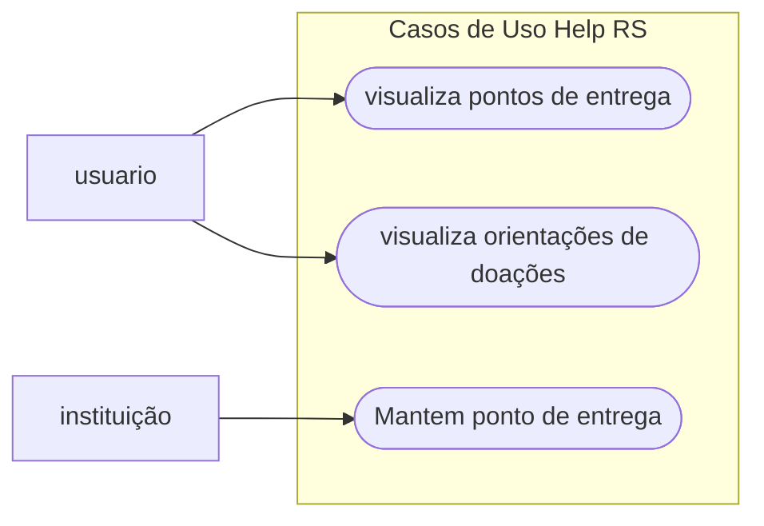

# secomp_backend_help_RS
Projeto elaborado para o minicurso de Backend em Python na Semana da Computação UNEMAT. O curso terá apenas 6 horas mas abordará os principais conceitos da área de desenvolvimento Backend. Durante toda essa caminhada iremos colocar nossas mão no teclado e desenvolver uma aplicação que possa ajudar a maximizar o número de doações que são destinadas as áreas afetadas do Rio Grande do Sul.

### Visão geral
Help_RS tem como objetivo ser um serviço destinado a doadores e a empresas ou órgãos que estão coletando essas doações para o Rio Grande do Sul. O desenvolvimento baseia-se na construção do Backend dessa aplicação. 

### Funcionalidades
- fornecer aos Doadores informações de como e onde estar entregando suas doações;
- As empresas e órgãos devem se cadastrar ao sistema e realizar o login;
- As empresas e órgãos realizam o cadastro das informações referentes às doações.

### Casos de Uso

# Contribuições

Solicitações pull são bem-vindas. Para mudanças importantes, abra um [issue](https://github.com/gustavo-patricio/secomp_backend_help_RS/issues/) primeiro
para discutir o que você gostaria de mudar.

# Licença

[MIT](https://choosealicense.com/licenses/mit/)
